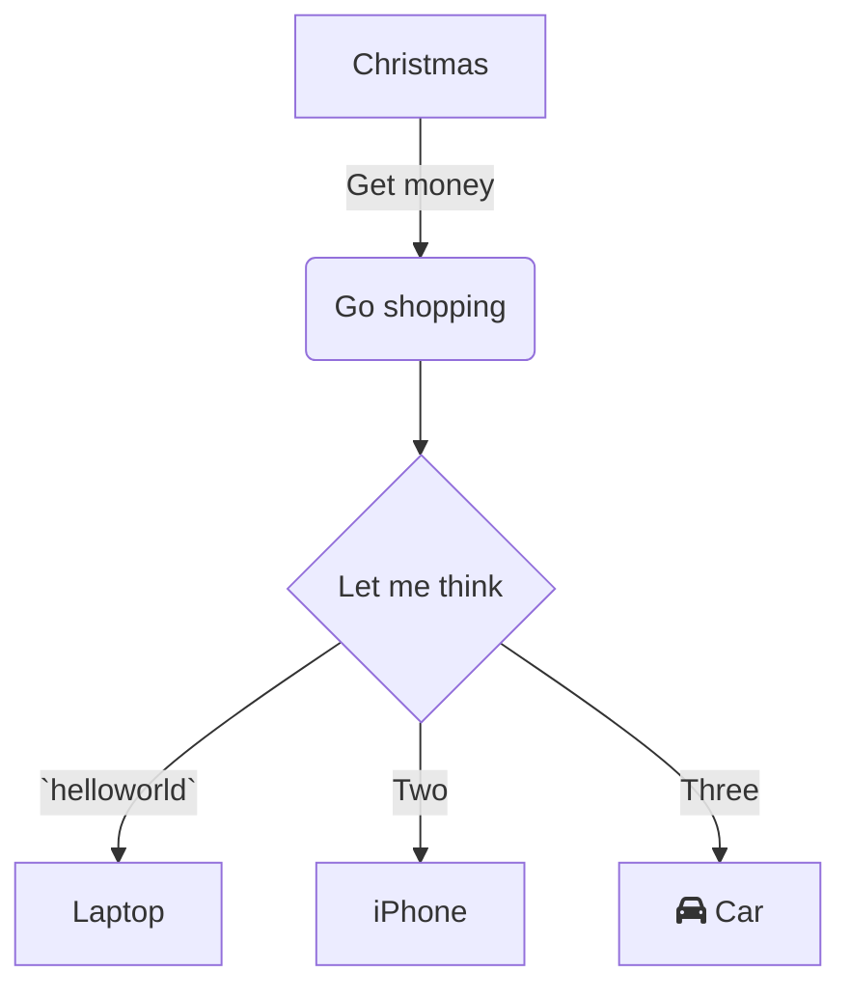

This is the main method, entry point for the application.

<!-- empty line --><br/>

<!-- empty line --><br/>
<!-- NOTE-swimm-snippet: the lines below link your snippet to Swimm -->
### 📄 src/main/java/com/example/demo/DemoApplication.java
```java
9      	public static void main(String[] args) {
10     		SpringApplication.run(DemoApplication.class, args);
11     	}
```

<br/>

It works! `helloworld`<swm-token data-swm-token=":src/main/java/com/example/demo/controller/DemoController.java:8:6:6:`    @GetMapping(&quot;/helloworld&quot;)`"/>
<!-- NOTE-swimm-snippet: the lines below link your snippet to Swimm -->
### 📄 src/main/java/com/example/demo/controller/DemoController.java
```java
9          public String hello() {
10             return getString();
11         }
```

<br/>

<!--MERMAID {width:50}-->

<!--MCONTENT {content: "graph TD<br/>\nA\\[Christmas\\] \\-\\-\\>|Get money| B(Go shopping)<br/>\nB \\-\\-\\> C{Let me think}<br/>\nC \\-\\-\\>|`helloworld`<swm-token data-swm-token=\":src/main/java/com/example/demo/controller/DemoController.java:8:6:6:`    @GetMapping(&quot;/helloworld&quot;)`\"/>| D\\[Laptop\\]<br/>\nC \\-\\-\\>|Two| E\\[iPhone\\]<br/>\nC \\-\\-\\>|Three| F\\[fa:fa-car Car\\]<br/>\n<br/>"} --->

<br/>


<!-- NOTE-swimm-snippet: the lines below link your snippet to Swimm -->
### 📄 src/main/java/com/example/demo/DemoApplication.java
```java
6      @SpringBootApplication
7      public class DemoApplication {
8      
9      	public static void main(String[] args) {
10     		SpringApplication.run(DemoApplication.class, args);
11     	}
12     
13     }
```

<br/>

This file was generated by Swimm. [Click here to view it in the app](/repos/Z2l0aHViJTNBJTNBZG9jLWFkdmVudHVyZSUzQSUzQUdhbGF0ZWFKYXZpZXI=/docs/hs668).
